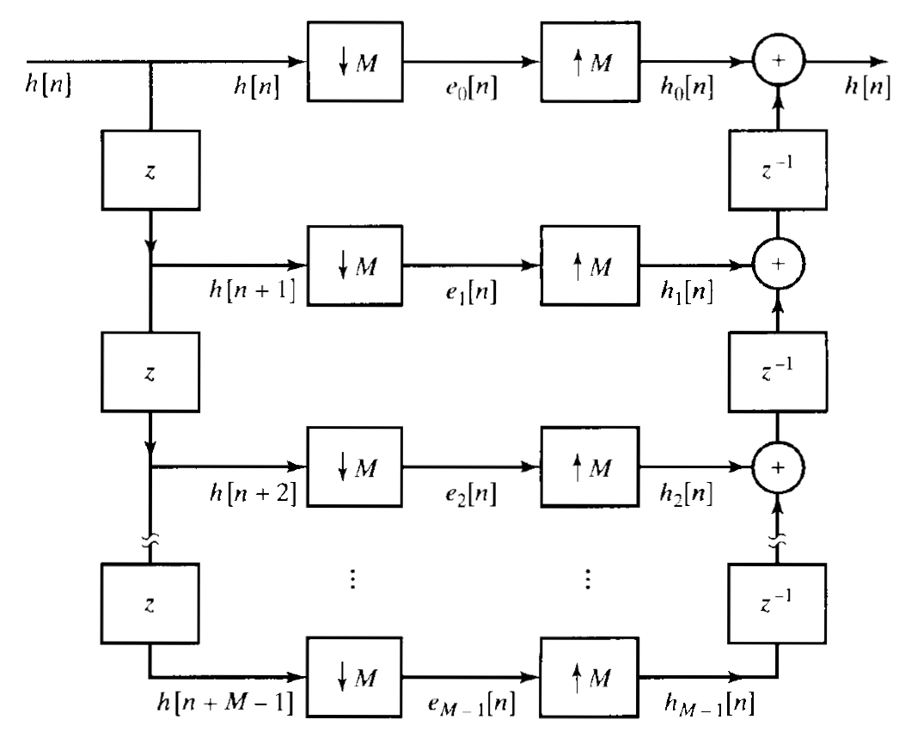

# 🔄 Polyphase Filters: Structure, Operation, and Advantages

**Polyphase filters** are an efficient solution in digital signal processing for tasks like **decimation** (downsampling) and **interpolation** (upsampling). Instead of processing and then discarding unnecessary data, polyphase filters restructure the filter into **parallel components** to compute only what's needed — saving significant computational effort.

---

## 🔧 Key Characteristics

| Feature                 | Description                                                                 |
|-------------------------|-----------------------------------------------------------------------------|
| **Phase Decomposition** | A filter is broken into multiple sub-filters (polyphase components)         |
| **Multiple Delay Lines**| Multiple parallel paths process the input rather than one long delay line   |
| **Computational Efficiency** | Avoids computing discarded samples in decimation or interpolation           |
| **Rate Conversion**     | Ideal for downsampling and upsampling operations                           |
| **Frequency Demultiplexing** | Can split signals into frequency subbands (e.g. channelizers)            |
| **Applications**        | Used in audio, telecom, SDRs, and multirate systems                         |

---

## ⚙️ How Polyphase Filters Work

### 🔹 1. Standard FIR Filtering + Downsampling (Inefficient)

A standard FIR filter applies to every input sample, even if many are later discarded:

\[
y[n] = \sum_{k=0}^{N-1} h[k] \cdot x[n - k]
\]

Then you downsample:

\[
y_{\text{dec}}[n] = y[nM]
\]

This computes all output samples and **throws away (M−1)/M of them**.

---

### 🔹 2. Polyphase Decomposition (Efficient)

The FIR filter \( h[n] \) is split into \( M \) polyphase components:

\[
h[n] = \sum_{m=0}^{M-1} e_m[n] \cdot \delta[n - m]
\]

Where each sub-filter is:

\[
e_m[n] = h[nM + m]
\]

Then the output is computed as:

\[
y[n] = \sum_{m=0}^{M-1} \sum_{k=0}^{L-1} e_m[k] \cdot x[nM - kM - m]
\]

✅ This computes **only the samples that will be used**, improving efficiency dramatically.

---

## 🧮 Advantage Summary

| Operation                  | Standard Filter + Downsample         | Polyphase Filter                          |
|---------------------------|---------------------------------------|-------------------------------------------|
| Multiplications per output| \( N \)                               | \( N/M \)                                 |
| Sample processing         | All inputs filtered                   | Only necessary inputs processed           |
| Efficiency                | Low (wasteful)                        | High, especially for large M              |

---

## 🧪 Common Applications

- Sample rate conversion (e.g., 48kHz → 16kHz)
- Digital up/down converters (DUC/DDC)
- Audio resampling
- Multi-channel filter banks
- Software-defined radios
- Channelization in baseband receivers

---

## ✅ Benefits at a Glance

| Benefit                      | Description                                                                 |
|-----------------------------|-----------------------------------------------------------------------------|
| **Computational savings**   | Avoids filtering samples that would be discarded                           |
| **Flexible design**         | Supports modular implementation and hardware efficiency                    |
| **Accurate rate conversion**| Minimal distortion in decimation/interpolation                             |
| **Supports FFT filter banks** | Core building block in efficient frequency decomposition                  |

---

## 🧠 Summary

Polyphase filters are the **foundation of efficient multirate digital signal processing**. Whether you're building a radio, audio resampler, or digital communication system, using polyphase decomposition lets you:

- Lower computational cost
- Retain signal fidelity
- Scale across multiple channels and sample rates

---
_Last updated: June 06, 2025
