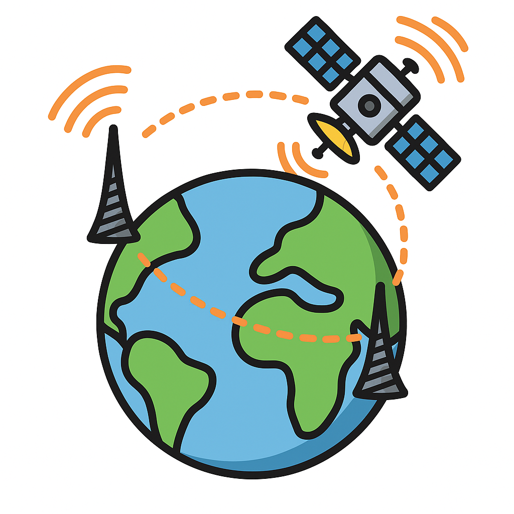
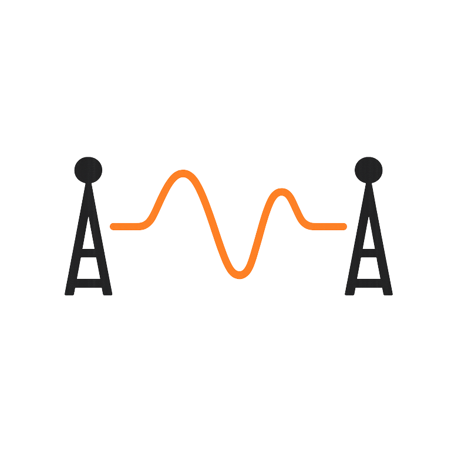
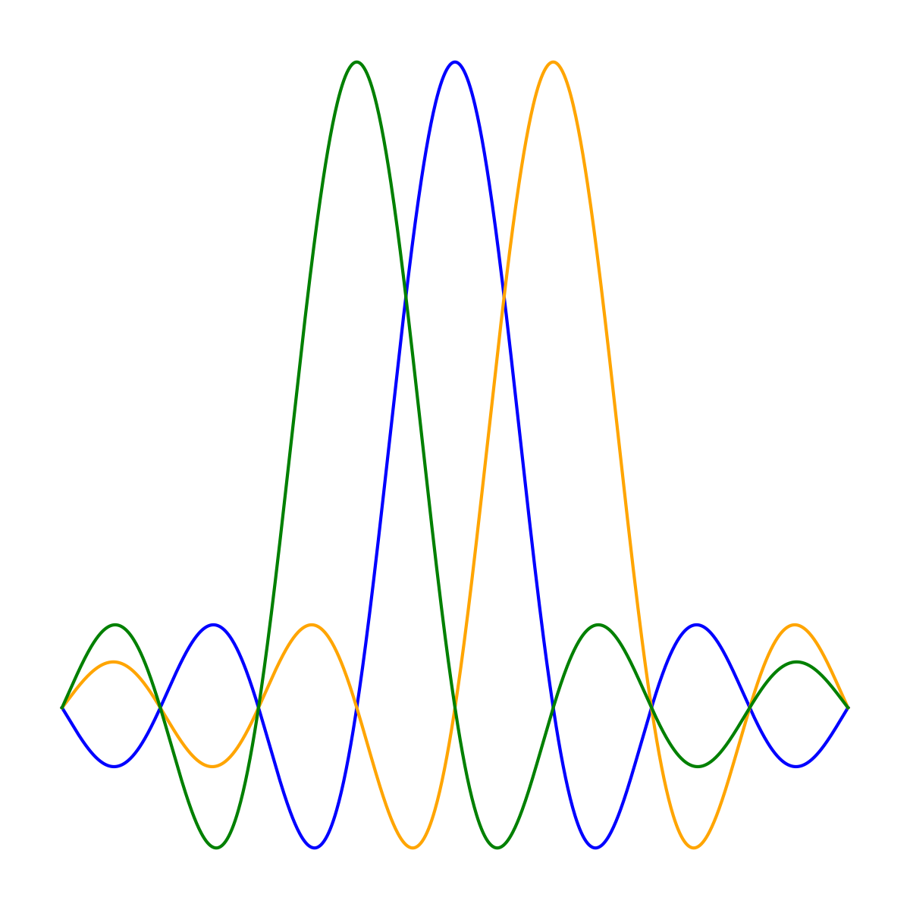

# Welcome to Wireless Review

This site offers a concise, visual reference to core wireless communication concepts and formulas—ideal for interview preparation and quick refreshers. Use the sidebar to browse topics.

---

# Wireless Communications Topics

### [Maxwell's Equation](wireless/Maxwells_equations.md)
Fundamentals of electromagnetic theory for wireless systems.

### [Fading Channel Types](wireless/fading_types_summary.md)
Overview of fast/slow fading, coherence time, and modeling.

### [Shannon Capacity](wireless/shannon.md)
Theoretical limits of data rate and spectral efficiency.

### [Link Budget](wireless/link_budget.md)
Step-by-step guide for system gain/loss calculations.

### [Modulation Techniques](wireless/modulation.md)
Review PSK, QAM, and bandwidth-efficient schemes.

### [MU-MIMO Detectors](wireless/multiusermimodetectors.md)
Principles of spatial multiplexing and user separation.

### [OFDM](wireless/ofdm.md)
Understand multicarrier modulation and its benefits.

### [Waterfilling Concept](wireless/Waterfilling.md)
Optimal power allocation under bandwidth constraints.

### [OFDM Channel Estimation](wireless/ChannelEstimation.md)
Pilot-based methods for estimating wireless channels.

### [OFDM Channel Equalization](wireless/Channel_Equalization.md)
Mitigating inter-symbol interference and distortion.

### [Implementation Imperfections](wireless/implementationImperfections.md)
Effects of hardware nonidealities and design constraints.

---

_Last updated: June 06, 2025_
